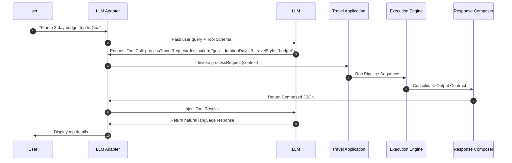

# Travel Intelligence OS - LLM Adapter Specification

This document defines the architecture, provider interfaces, tool-calling mechanisms, and sequence flows of the LLM Adapter (`backend/llm/llm_adapter.js`). It acts as a deterministic communication bridge between external Large Language Models (LLMs) and the rule-based backend.

---

## 1. Objective

The LLM Adapter provides a unified, provider-agnostic interface that enables any supported LLM (Gemini, Claude, GPT, or local models) to interact with the backend without containing any travel planning business logic. The adapter:
- Translates natural language queries into structured inputs for the backend.
- Exposes backend capabilities as tools/functions that the model can invoke.
- Formats structured backend responses back into natural language for the end user.
- Allows seamless replacement of the underlying model provider without modifying core engines.

---

## 2. Responsibilities

- **Provider Abstraction**: Exposes a common API surface regardless of client library differences.
- **Prompt Construction**: Programmatically generates system directives, memory profiles, and history contexts.
- **Tool / Function Calling**: Mapped tool execution loops calling `TravelApp.processRequest`.
- **Structured Parsing**: Validates and repairs malformed JSON payloads.
- **Context Window Management**: Sliding history windows, summarization hooks, and token budgeting.
- **Token Accounting**: Track query/completion token counts and input costs.

---

## 3. Supported Providers

- **Google Gemini**: Gemini 1.5 Flash (default for speed/cost) and Gemini 1.5 Pro (complex queries).
- **Anthropic Claude**: Claude 3.5 Sonnet (complex analysis).
- **OpenAI GPT**: GPT-4o and GPT-4o-mini.
- **Local LLMs**: Llama 3 via Ollama (offline support).

---

## 4. Provider Interface

Every provider must implement the abstract class `BaseLLMProvider`:

```typescript
interface BaseLLMProvider {
  /** Initialize credentials, client objects, and environment setups */
  initialize(): Promise<boolean>;

  /** Primary query interface returning text-to-text completions */
  generate(prompt: PromptContainer, config: GenerationConfig): Promise<LLMResponse>;

  /** Handles async server-sent events for streaming outputs */
  stream(prompt: PromptContainer, config: GenerationConfig, callback: StreamCallback): Promise<void>;

  /** Declares functions and returns requested tool-calls requested by the LLM */
  toolCall(prompt: PromptContainer, tools: ToolDefinition[]): Promise<ToolCallResult>;

  /** Verifies structured format compliance before returning data */
  validateResponse(response: LLMResponse, schema: object): boolean;

  /** Basic connection and API validation hook */
  healthCheck(): Promise<boolean>;
}
```

---

## 5. Prompt Management

System inputs are strictly organized before sending payload parameters:
- **`System Prompt`**: High-level behavioral rules (e.g. constraints not to hallucinate, locked personality profiles).
- **`Developer Prompt`**: Explicit formatting and parsing instructions.
- **`User Prompt`**: The active text query submitted by the traveler.
- **`Tool Results`**: Structured output from `ResponseComposer` injected back into the prompt context.
- **`Conversation History`**: Previous user and assistant dialogue exchanges.

---

## 6. Tool Calling

The LLM does not run plans itself; it triggers tool parameters:



---

## 7. Structured Output

For backend configuration commands, the LLM must return strict JSON:
- **JSON Recovery**: Automatically extracts JSON block strings from markdown wrapping (` ```json ` tags).
- **Validation**: Performs JSON-schema validation checks.
- **Retry Strategy**: If validation fails, resubmits the parsing errors back to the model for correction (up to 3 retries).

---

## 8. Context Management

- **Sliding History**: Limits conversation history to the last 10 messages.
- **Context Compression**: Summarizes older message threads if token count exceeds 70% of model limit.
- **Token Budgeting**: Rejects user inputs exceeding 4,000 characters to prevent prompt bloat.

---

## 9. Streaming

- **Partial Responses**: Emits chunks using Server-Sent Events (SSE).
- **Cancellation**: Aborts the underlying HTTP connection instantly if user requests stop/cancel.
- **Progressive Rendering**: Yields incremental text stream outputs without blocking UI state.

---

## 10. Model Selection & Routing

Dynamic routing rules decide which model executes:
- **`Standard Chat`**: Routed to `Gemini 1.5 Flash` or `GPT-4o-mini` (lowest latency).
- **`Complex Queries & Summarization`**: Routed to `Gemini 1.5 Pro` or `Claude 3.5 Sonnet` (higher reasoning capacity).
- **`Offline Mode`**: Fallback to `Llama-3 (Ollama)`.

---

## 11. Error Handling

- **Rate Limits**: Catch HTTP 429 status codes and apply exponential backoff (starting at 1000ms).
- **Hallucinated Tool Calls**: If LLM requests a non-existent tool, the adapter catches the request, bypasses tool invocation, and injects a warning into the prompt context.
- **Provider Outage**: Automatically falls back to secondary provider (e.g. if Claude fails, route to Gemini).

---

## 12. Security

- **Prompt Injection Defense**: Strips system command keywords (`system:`, `instruction:`, `override:`) from user inputs.
- **Secrets Isolation**: API tokens stored only in environment variables (`process.env.GEMINI_API_KEY`, `process.env.ANTHROPIC_API_KEY`).
- **Data Anonymization**: Redacts email addresses, passport numbers, and telephone details before queries are sent to public APIs.

---

## 13. Extensibility

Adding a new provider (e.g. Cohere or custom internal models):
1. Create a new class under `backend/llm/providers/` extending `BaseLLMProvider`.
2. Implement required interfaces (`initialize`, `generate`, etc.).
3. Register the new provider key inside `llm_adapter.js`. No changes are required in conversation classifier or execution orchestrators.

---

## 14. Out of Scope

The LLM Adapter MUST NOT:
- Calculate budget spending.
- Select or swap hotel accommodations.
- Run route optimizations or calculate driving coordinates.
- Suggest attraction alternatives.

All such decisions remain 100% deterministic inside the backend engines.
