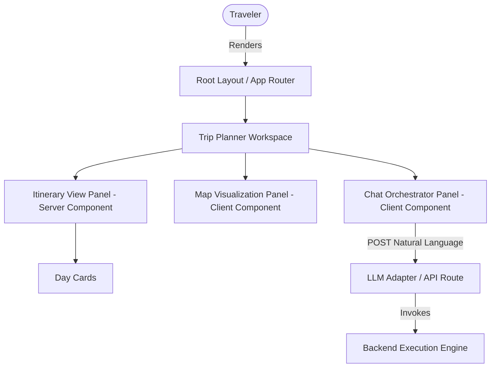

# Frontend Architecture Specification - Travel Intelligence OS

## Design Manifesto

> **Travel Intelligence OS is not a booking website.**
> **It is not a chatbot.**
> **It is not a dashboard.**
> **It is a Travel Operating System.**
>
> Every pixel should help users feel they are planning, understanding and experiencing a journey.
> The interface should disappear behind the experience.
> Movement should feel like progression.
> Cards should feel like pages from a travel journal.
> Timelines should feel like routes.
> Maps should feel alive.
> Planning should feel effortless.
> The user should always feel in control while the AI quietly handles complexity.

---

## 1. Core Architecture Pattern
We use **Next.js 14+ (App Router)** as the framework core, enforcing a strict separation of concerns between Server Components (data fetching, optimization) and Client Components (interactive state, micro-animations).

---

## 2. Server vs. Client Component Boundaries
To minimize client-side bundle sizes and optimize Time-To-Interactive (TTI), components are split based on interactivity requirements:

### Server Components (Default)
- **`Layouts`**: Root layout, workspace sidebar, navigation panels.
- **`Itinerary Details`**: High-level daily itinerary card render, static budget summary text.
- **`Destination Overview`**: Static description cards, weather information lists, local custom rules.

### Client Components (`"use client"`)
- **`Chat Workspace`**: Dynamic message list, streaming tokens panel, user inputs form.
- **`Map View`**: Leaflet/Mapbox vector interactive route visualizations and marker plots.
- **`Memory Drawer`**: Fly-out drawer displaying user history and real-time preference updates.
- **`Transition Controllers`**: Framer Motion orchestrators that animate page swaps.

---

## 3. Streaming and Suspense Architecture
Trip planning computations take time. The interface utilizes Next.js **Suspense** and server-sent events (SSE) to prevent blocking the UI:

1. **Immediate Skeleton**: When a trip plan is requested, the page immediately swaps layout and renders skeleton cards.
2. **SSE Stream Listener**: The Chat component establishes a listener to stream natural language explanations token-by-token.
3. **Selective Rehydration**: As the planner resolves slots, individual daily cards rehydrate dynamically rather than waiting for the entire 5-day plan to finish loading.

---

## 4. Workspaces and Multi-Tab Navigation
The application operates in three core workspace layouts:
1. **`Onboarding Workspace`**: A cinematic, single-focus question sequence to populate the base User Profile (preferences, pace).
2. **`Chat Workspace`**: A distraction-free dialogue center where the user talks to the travel engine.
3. **`Itinerary Workspace`**: A dual-panel screen (Interactive Itinerary on the left, Dynamic Map on the right) for editing and visualizing active trips.
